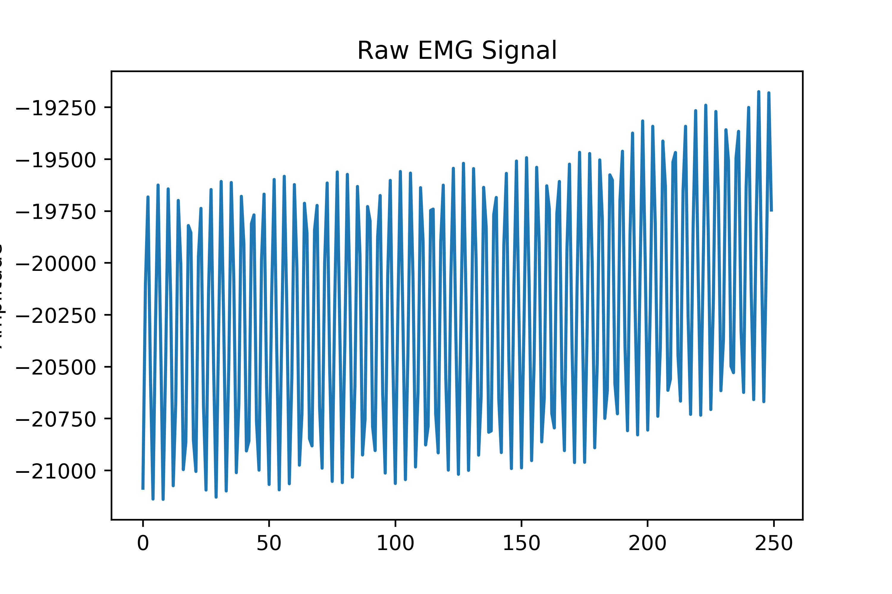
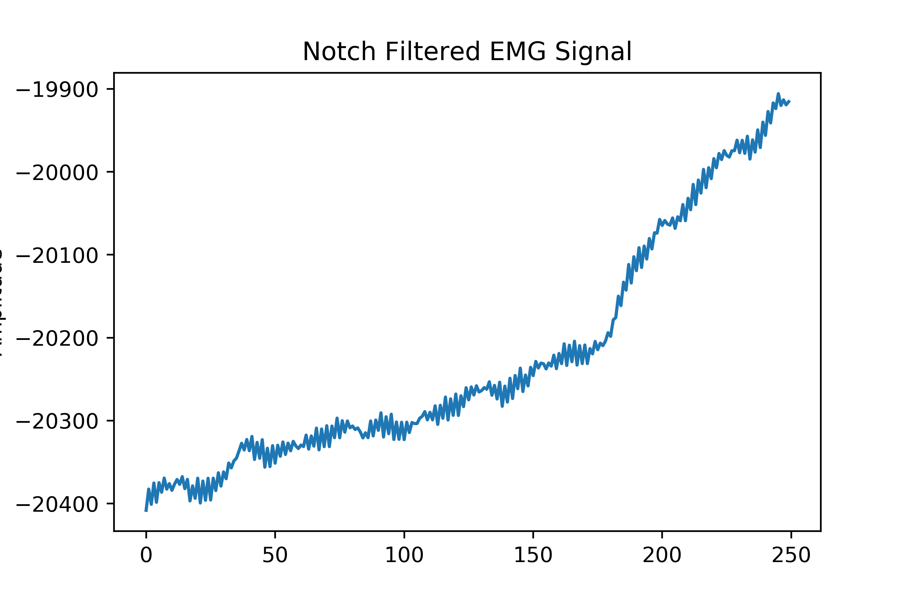
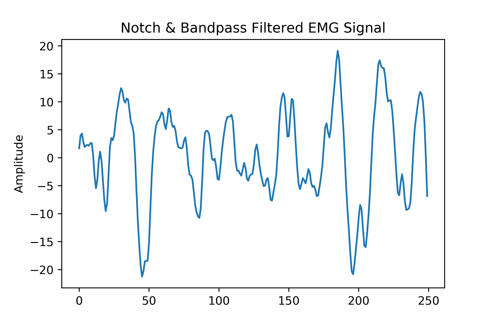

# Signal Processing

## Dependencies
* [Python 3.7.6](https://www.python.org/downloads/) or later
* [Numpy 1.18.1](https://numpy.org/) or later
* [Matplotlib 3.1.3](https://matplotlib.org/) or later
* [Pandas 1.0.3](https://pandas.pydata.org/) or later
* [Scipy 1.4.1](https://www.scipy.org/) or later

## EMG Signals
Electromyography (EMG) signals are noisy, non-stationary, and complex.

### Filtering

Based on prior experience with neurological signals, we opted to use Infinite Impluse Response (IIR) filters. 
Surface EMG signals can lie anywhere in the 5-450 Hz frequency range; however, due to having a sampling rate limitation of only 250 Hz, we were unable to explore higher frequencies values.
In order to denoise a signal, we first notch filter the EMG signal at 60 Hz to remove powerline interference, then we apply a 4th order Butterworth Bandpass filter the signal to keep the frequency range of interest.

Much of the options we explored involved finding the ideal frequency band for our purposes.
Through our experiments, we found the 5-50 Hz range produceed the best results with our models.
Another detail we adjusted was finding a sufficient quality factor to use for the notch filter.
At first we relied on values of 4 and 15 but we ultimately chose to use a factor of 60.

### Signal Formatting

We developped two different formatting procedures, depending on whether the data was received "offline" or "online".
The former refers to data received through a data collection trial. 
We call it "offline" because we stored the entire signal for analysis and training our models.
The latter refers to data received while actually running the armband, hence it is data we must process while the armband is "online".

#### Offline Training

Offline data is split into two files: one containing the raw EMG signals generated by the OpenBCI GUI and one containing the timestamped labels of finger movements generated by us.
Since offline data is stored, we can filter the entire signal at once.
However, to train a model to classify these signals, the raw EMG data needed to be labelled and segmented into overlapping windows.
This means we need to map the labels to the signal sample points.
Essentially, the steps are as follows (for more details, refer to the files `match_labels.py` and `windowing_helpers.py`):

1. Initialize all window labels as baseline events.
2. If a window is within a certain timeframe of a timestamped label, the window receives the given label.
3. To reduce misclassification, we calculate the Power Spectral Density (PSD) of each channel and if none exceed a threshold, we relabel the window as baseline.

#### Online Performance

Unlike offline data, after the online passes through the model, it is discarded.
Therefore we cannot filter online data in a single pass.
Moreover, due to the windows overlapping, we also couldn't simply filter the windows in batches, or else we'd have filtering artifacts at the start of every window!
In light of this, for online data we filter the signal point-by-point and store the state of the signal coefficients at the start of the overlap between successive windows.
This way we can correctly filter incoming windows as if we were doing it offline.

The specific differences between the implementations of offline filter, which we call the `'original_filter'`, and the online filter, which we call the `'real_time_filter'`, can be seen in the file `filtering.py`.

# A comprehensive list of the features used

### Time-domain features
* iemg : the sum of the absolute value of the signal - almost identical to mav
* mav : the average absolute value of the signal
* mmav : a trapezium looking weights for multiplying the absolute value of the signal - convolution like
* mmav2 : a hat shaped weights - convolution like
* var : the mean is assumed to be 0 - so this is essentially just the mean of the squares, which is just the square of rms, they are not independent!
* var_abs : this is the varience of the absolute values
* zc :  zero-crossings - the number of times it crosses the zero and the distance between the two points either side of the crossing is greater than some critical value - this function takes a threshold, we need to determine what a good threshold is
* wamp : the willison amplitude,  - for this features also we need to determine what constitutes a good threshold is
* wl : the sum of the absolute value of the differences between two successive terms
* ssch : the number of times the sign of the slope changes
* wfl : exactly the same as wl but scaled by a factor of length of window (we can get rid of this one)
* rms_3 : splits the signal into 3 equal parts and computes 3 features, rms for each part

### Frequency domain features
* freq_feats : the means of truncated intervals 5:20 , 20:40 , 40:60 , 60:80 , 80:100 , 100:120
* freq_var : the varience in fft for low, medium and high frequency wavelengths :40 , 40:80 , 80:
* freq_misc : ssch, mav, mmav, zc applied to the Fourier transform
