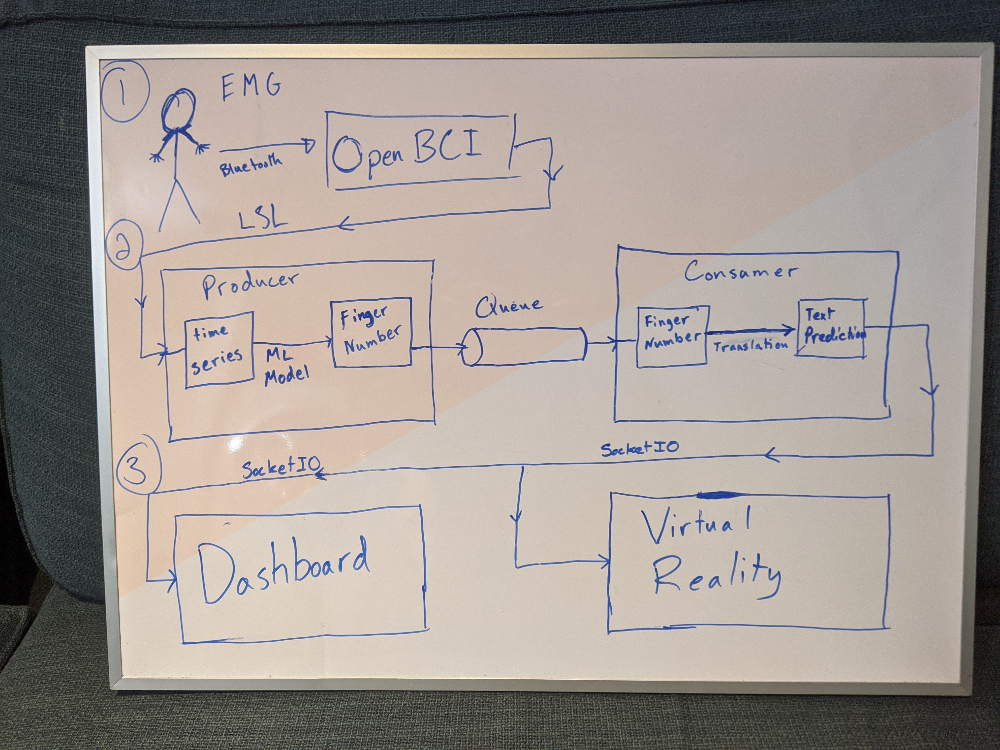

- [Architecture](#sec-1)
- [Usage](#sec-2)
  - [Interaction](#sec-2-1)
  - [Setup](#sec-2-2)
  - [Parameters](#sec-2-3)
- [Connecting with AR](#sec-3)
  - [Instructions](#sec-3-1)
    - [Most Likely Words](#sec-3-1-1)
    - [Enter Word Selection Mode](#sec-3-1-2)
    - [Capture word](#sec-3-1-3)
    - [Delete Word](#sec-3-1-4)
    - [Exit Typing Mode](#sec-3-1-5)
    - [Error Message](#sec-3-1-6)
- [prediction<sub>server.py</sub>](#sec-4)

# Architecture<a id="sec-1"></a>



# Usage<a id="sec-2"></a>

## Interaction<a id="sec-2-1"></a>

Keyboard inputs:

-   **"space":** select the most likely word
-   **"backspace":** delete last character if one exists, otherwise last word
-   **"C-c":** exit
-   **"0":** Enter word selection mode. Then select a word by pressing a lower case char associated with the desired index
-   **lower case char:** input finger associated with character

## Setup<a id="sec-2-2"></a>

Environment (assuming python3):

```bash
python -m venv venv
source venv/bin/activate
python -m pip install -r requirements.txt
```

Download a finger number prediction model into \`NeuroTech-ML/models\` and set the `model_file` variable in `backend.py`.

Run:

```bash
python backend.py
```

In order for the backend to run with `finger_mode = True`, Start the data stream in OpenBCI. In the networking widget, switch to LSL and set Stream 1 with the following settings:

-   **Data Type:** "Timeseries"
-   **Name:** obci<sub>eeg1</sub>
-   **Type:** EEG
-   **# Chan:** 8

Then press "Start" in the networking widget.

## Parameters<a id="sec-2-3"></a>

There are two configurable variables in backend.py

-   **server<sub>mode</sub>:** Indicates whether or not to emit predictions and data over socketio
-   **finger<sub>mode</sub>:** When true, reads signal data from OpenBCI and converts it to finger numbers. When false, reads keypresses from stdin and converts them to finger numbers.

# Connecting with AR<a id="sec-3"></a>

We maintain the state of the word being built in the backend, and send the frontend instructions for updating the UI accordingly.

Backend state:

-   current finger word
-   finger selection mode

Frontend state:

-   most likely words
-   finger selection mode
-   previously typed words
-   most recently typed character

## Instructions<a id="sec-3-1"></a>

### Most Likely Words<a id="sec-3-1-1"></a>

Instruction to update the most likely words in the frontend

```json
{
  "message": "most_likely_words",
  "words": ["word1", "word2", ...],
}
```

### Enter Word Selection Mode<a id="sec-3-1-2"></a>

Instruction to enter word selection mode in the frontend

```json
{
  "message": "enter_word_selection"
}
```

### Capture word<a id="sec-3-1-3"></a>

Instruction to capture/select a word.

```json
{
  "message": "select_word",
  "word": "word2"
}
```

### Delete Word<a id="sec-3-1-4"></a>

Instruction to delete a word backwards

```json
{
  "message": "delete_word",
}
```

### Exit Typing Mode<a id="sec-3-1-5"></a>

Instruction to leave typing mode

```json
{
  "message": "leave_typing_mode"
}
```

### Error Message<a id="sec-3-1-6"></a>

Instruction to display error message. Potential errors:

-   could not enter word selection mode
-   could not select word

```json
{
  "message": "error_message",
  "error_code": "could_not_select_word"
}
```

# prediction<sub>server.py</sub><a id="sec-4"></a>

Contains the PredictionServer class. Functions:

-   reads finger numbers from a queue
-   emits data for the dashboard and virtual reality clients via socketio
-   builds word predictions from a dictionary of most common english words

The socketio server runs on port 4002.
